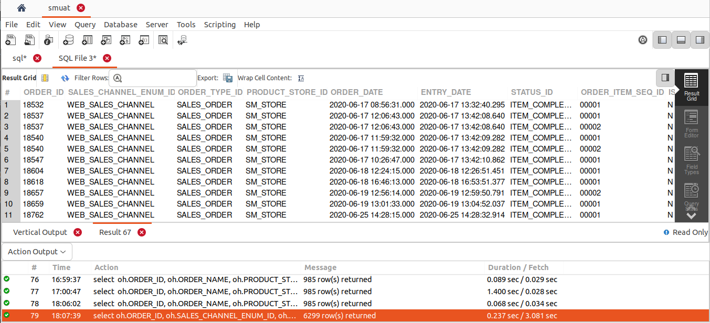
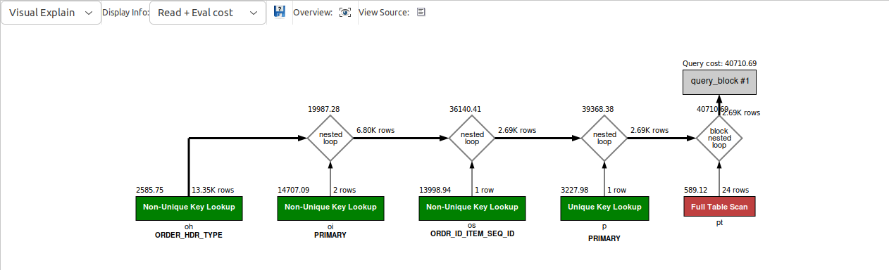

## QUERY
    Fetch the following columns for completed order items for sales orders of SM_STORE product store and that are physical items.
    ORDER_ID
    ORDER_ITEM_SEQ_ID
    PRODUCT_ID
    PRODUCT_TYPE_ID
    IS_PHYSICAL
    IS_DIGITAL
    SALES_CHANNEL_ENUM_ID
    ORDER_DATE
    ENTRY_DATE
    STATUS_ID
    STATUS_DATETIME
    ORDER_TYPE_ID
    PRODUCT_STORE_ID 


## SOLUTION
``` sql 
select 
  oh.ORDER_ID, 
  oh.SALES_CHANNEL_ENUM_ID, 
  oh.ORDER_TYPE_ID, 
  Oh.PRODUCT_STORE_ID, 
  oh.ORDER_DATE, 
  oh.ENTRY_DATE, 
  oi.STATUS_ID, 
  oi.ORDER_ITEM_SEQ_ID, 
  pt.IS_DIGITAL, 
  pt.IS_PHYSICAL, 
  os.STATUS_DATETIME 
from 
  order_header oh 
  join order_item oi on oh.order_id = oi.order_id 
  join order_status os on os.ORDER_ID = oi.ORDER_ID 
  and os.ORDER_ITEM_SEQ_ID = oi.ORDER_ITEM_SEQ_ID 
  and os.status_id = oi.status_id 
  join product p on oi.PRODUCT_ID = p.PRODUCT_ID 
  join product_type pt on pt.product_type_id = p.product_type_id 
where 
  oh.PRODUCT_STORE_ID = "SM_STORE" 
  AND oi.STATUS_ID = "ITEM_COMPLETED" 
  AND oh.ORDER_TYPE_ID = "SALES_ORDER" 
  AND pt.IS_PHYSICAL = "Y";
```

## OUTPUT



## QUERY COST 

