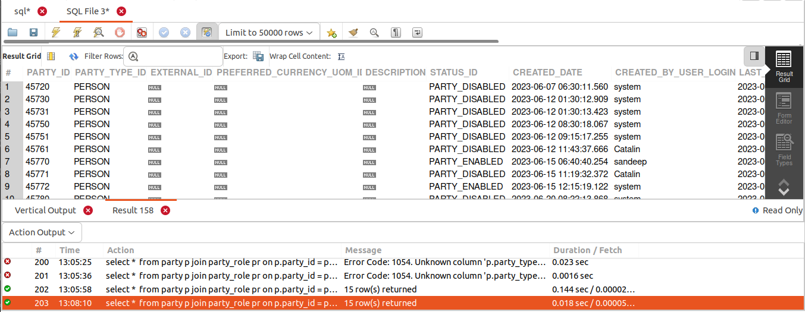
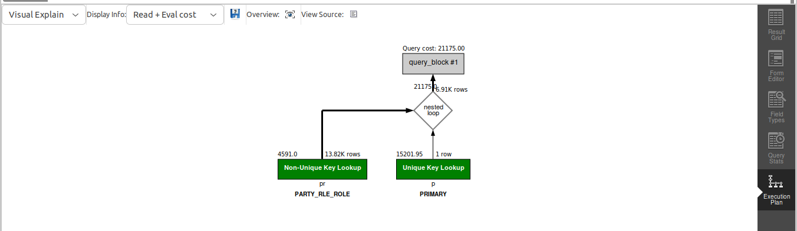

## QUERY
    
    Fetch all the customers created in June 2023.

## SOLUTION
```sql
select 
  * 
from 
  party p 
  join party_role pr on p.party_id = pr.party_id 
where 
  p.party_type_id = "PERSON" 
  and pr.role_type_id = "CUSTOMER" 
  and MONTH(p.created_date) = 6 
  AND YEAR(p.created_date) = 2023;

```

## OUTPUT

## QUERY COST 
