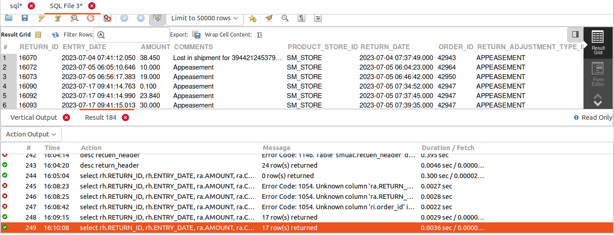
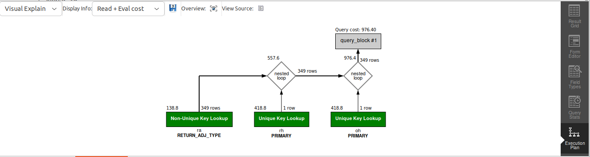

## QUERY
    Get all the appeasements in July month.
    1. How do we differentiate between returns and appeasements?
       
    Ans: where there are returns , its contains some quantity of items but in appeasements there is no item in return_item.

    2. Get all the below fields

    RETURN_ID
    ENTRY_DATE 
    RETURN_ADJUSTMENT_TYPE_ID
    AMOUNT
    COMMENTS 
    ORDER_ID
    ORDER_DATE 
    RETURN_DATE
    PRODUCT_STORE_ID


## SOLUTION

```sql
select 
  rh.RETURN_ID, 
  rh.ENTRY_DATE, 
  ra.AMOUNT, 
  ra.COMMENTS, 
  oh.PRODUCT_STORE_ID, 
  rh.RETURN_DATE, 
  oh.ORDER_ID, 
  ra.RETURN_ADJUSTMENT_TYPE_ID, 
  oh.ORDER_DATE 
from 
  return_header rh 
  join return_adjustment ra on rh.return_id = ra.return_id 
  join order_header oh on oh.order_id = ra.order_id 
where 
  ra.return_adjustment_type_id = "APPEASEMENT" 
  and YEAR(rh.RETURN_DATE) = 2023 
  and MONTH(rh.RETURN_DATE) = 7;


```

## OUTPUT



## QUERY COST 

