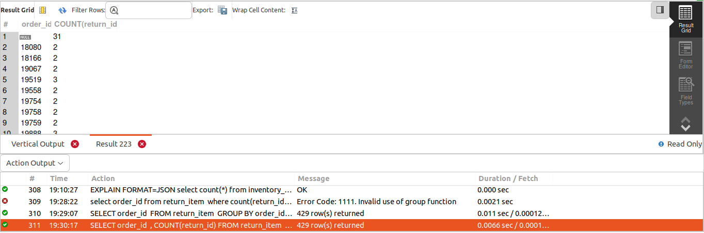

## QUERY
    Find all the orders that have more than one return.


## SOLUTION
```sql
select 
  ii.product_id, 
  iiv.inventory_item_id, 
  iiv.variance_reason_id 
from 
  inventory_item ii 
  join inventory_item_variance iiv on ii.inventory_item_id = iiv.inventory_item_id 
where 
  iiv.variance_reason_id in ("VAR_LOST", "VAR_DAMAGED");
```

## OUTPUT



## QUERY COST 

