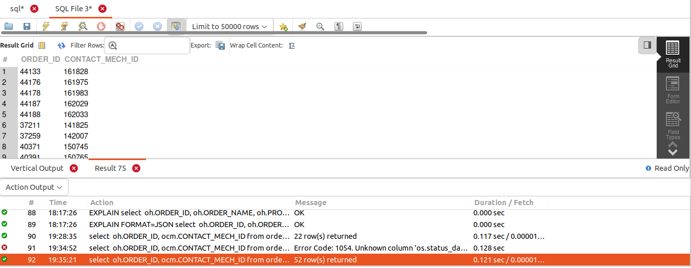
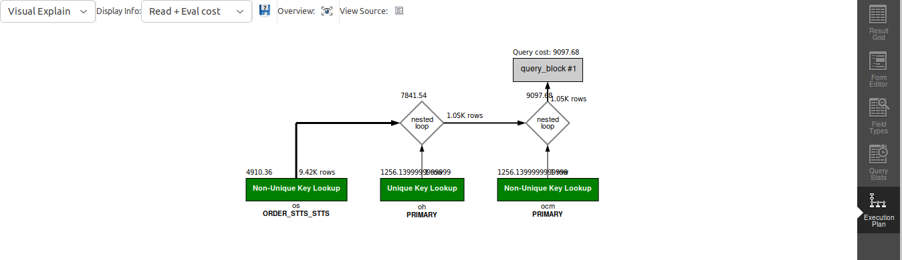

## QUERY
    Fetch the order id and contact mech id for the shipping address of the orders completed in October of 2023.

## SOLUTION
```sql
select 
  oh.ORDER_ID, 
  ocm.CONTACT_MECH_ID 
from 
  order_header oh 
  join order_contact_mech ocm on oh.order_id = ocm.order_id 
  join order_status os on oh.order_id = os.order_id 
where 
  os.status_id = "ORDER_COMPLETED" 
  and contact_mech_purpose_type_id = "SHIPPING_LOCATION" 
  and os.status_datetime between '2023-10-01' 
  and '2023-10-31';
```

## OUTPUT



## QUERY COST 

