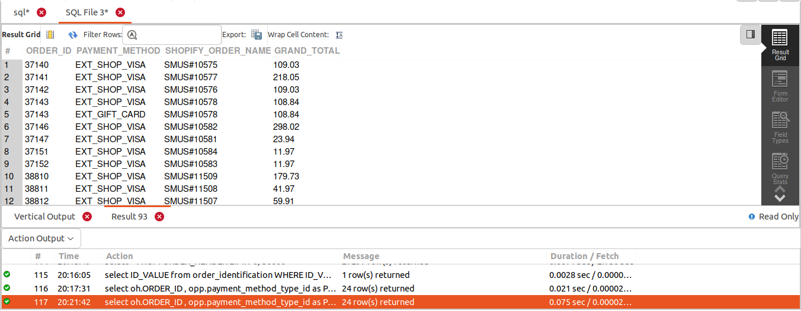
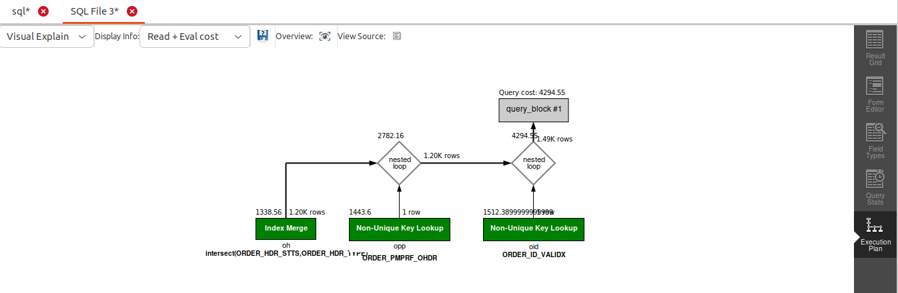

## QUERY
    Fetch the following columns for created orders. These should be sales orders.
    ORDER_ID
    TOTAL_AMOUNT
    PAYMENT_METHOD
    SHOPIFY_ORDER_NAME


## SOLUTION
```sql
select 
  oh.ORDER_ID, 
  opp.payment_method_type_id as PAYMENT_METHOD, 
  oh.ORDER_NAME as SHOPIFY_ORDER_NAME, 
  Oh.GRAND_TOTAL 
from 
  order_header oh 
  join order_payment_preference opp on oh.order_id = opp.order_id 
  join order_identification oid on oh.order_name = oid.id_value 
where 
  oid.order_identification_type_id = "SHOPIFY_ORD_NAME" 
  and oh.status_id = "ORDER_CREATED" 
  and oh.order_type_id = "SALES_ORDER";

```

## OUTPUT



## QUERY COST 

