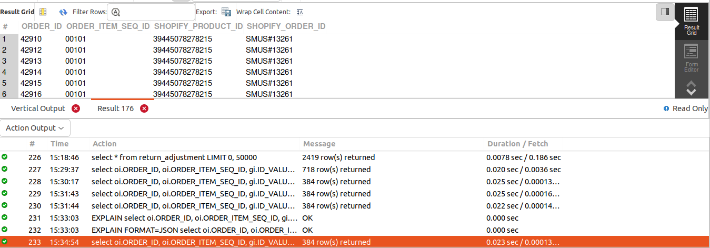
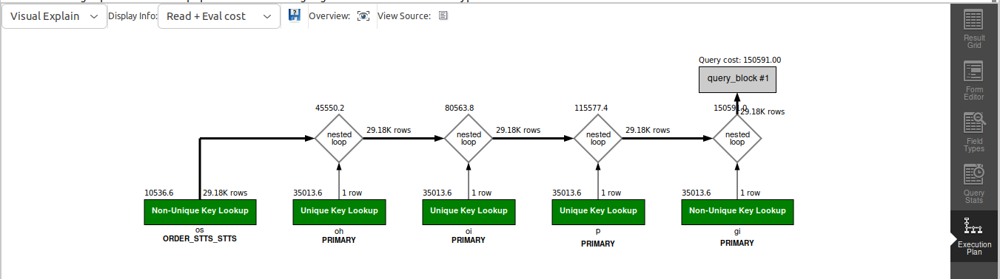

## QUERY
    Fetch the following data for completed order items in July of 2023
    ORDER_ID
    ORDER_ITEM_SEQ_ID
    SHOPIFY_ORDER_ID
    SHOPIFY_PRODUCT_ID


## SOLUTION
```sql
select 
  oi.ORDER_ID, 
  oi.ORDER_ITEM_SEQ_ID, 
  gi.ID_VALUE AS SHOPIFY_PRODUCT_ID, 
  oh.order_name as SHOPIFY_ORDER_ID 
from 
  order_item oi 
  join order_header oh on oh.order_id = oi.order_id 
  join order_status os on oi.order_id = os.order_id 
  and oi.order_item_seq_id = os.order_item_seq_id 
  join product p on oi.product_id = p.product_id 
  join good_identification gi on gi.product_id = p.product_id 
  and gi.good_identification_type_id = "SHOPIFY_PROD_ID" 
where 
  os.status_id = "ITEM_COMPLETED" 
  and YEAR(os.status_datetime) = 2023 
  and MONTH(os.status_datetime) = 7;


```

## OUTPUT



## QUERY COST 

