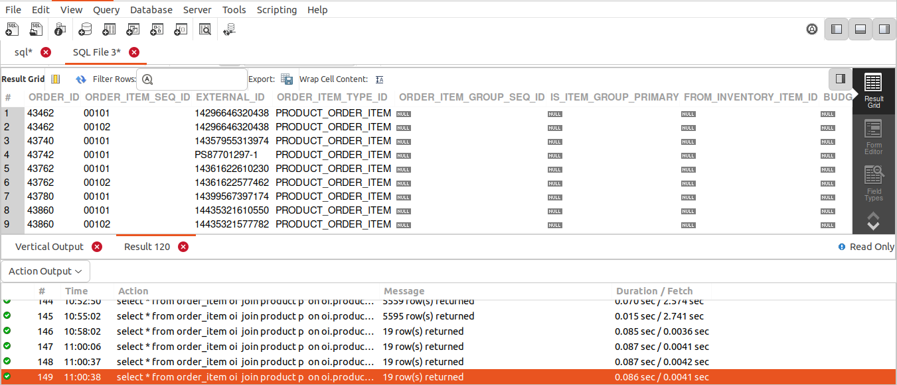
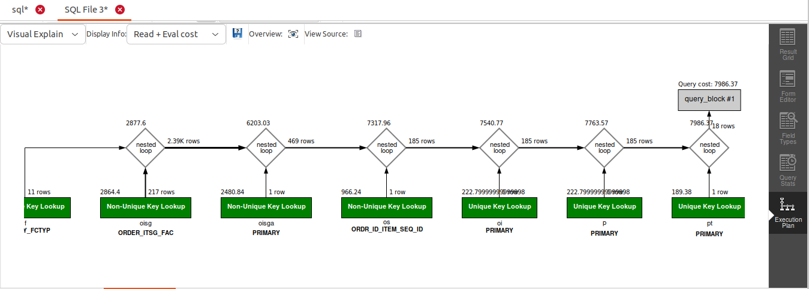

## QUERY
    Fetch all the physical items completed from Warehouse in September of 2023.   

## SOLUTION
```sql
select 
  * 
from 
  order_item oi 
  join product p on oi.product_id = p.product_id 
  join product_type pt on pt.product_type_id = p.product_type_id 
  join order_item_ship_group_assoc oisga on oi.order_id = oisga.order_id 
  and oi.order_item_seq_id = oisga.order_item_seq_id 
  join order_item_ship_group oisg on oisga.order_id = oisg.order_id 
  and oisga.ship_group_seq_id = oisg.ship_group_seq_id 
  join facility f on f.facility_id = oisg.facility_id 
  join order_status os on oi.order_id = os.order_id 
  and oi.order_item_seq_id = os.order_item_seq_id 
where 
  facility_type_id = "WAREHOUSE" 
  and os.status_id = "ITEM_COMPLETED" 
  and pt.is_physical = "Y" 
  and YEAR(os.status_datetime) = 2023 
  and MONTH(os.status_datetime) = 9;

```

## OUTPUT


## QUERY COST

