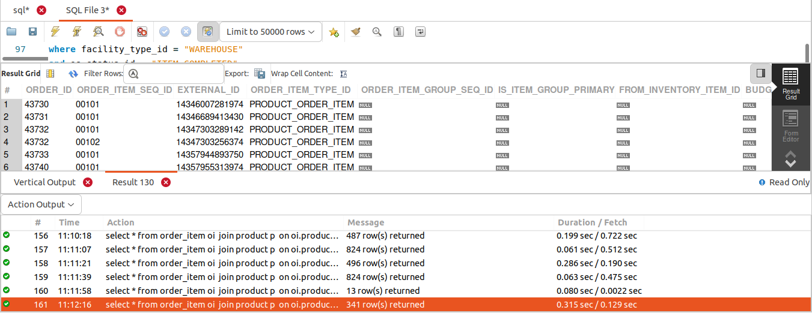
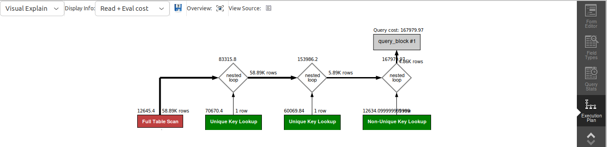

## QUERY
    Fetch all the physical items ordered in the month of September 2023.


## SOLUTION
```sql
select 
  * 
from 
  order_item oi 
  join product p on oi.product_id = p.product_id 
  join product_type pt on pt.product_type_id = p.product_type_id 
  join order_status os on oi.order_id = os.order_id 
  and oi.order_item_seq_id = os.order_item_seq_id 
where 
  os.status_id in ("ITEM_CREATED") 
  and pt.is_physical = "Y" 
  and YEAR(os.status_datetime) = 2023 
  and MONTH(os.status_datetime) = 9;

```

## OUTPUT



## QUERY COST 

