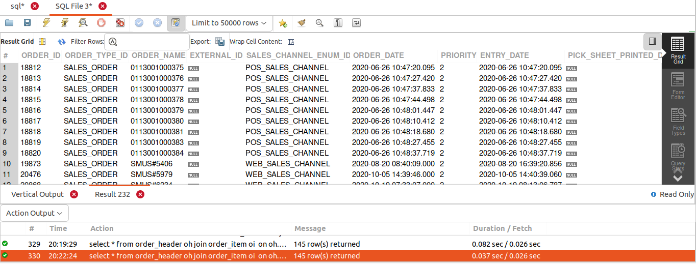
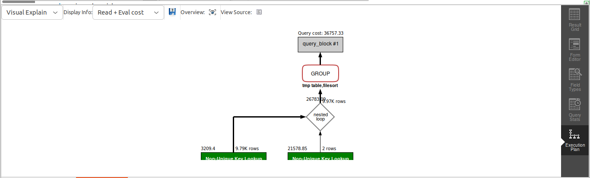

## QUERY

    Find all the orders whose two or more items are completed but the orders are still in the approved status.


## SOLUTION
```sql
select 
  * 
from 
  order_header oh 
  join order_item oi on oh.order_id = oi.order_id 
where 
  oh.status_id = "ORDER_APPROVED" 
  and oi.status_id = "ITEM_CANCELLED" 
group by 
  oi.order_id 
having 
  COUNT(order_item_seq_id) >= 2;
```

## OUTPUT



## QUERY COST 

