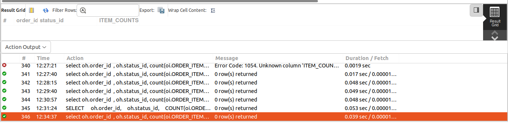
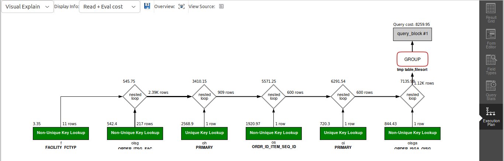

## QUERY

    How many single-item orders were fulfilled from warehouses in the last month?


## SOLUTION

``` sql
select 
  oh.order_id, 
  oh.status_id, 
  count(oi.ORDER_ITEM_SEQ_ID) as ITEM_COUNTS 
from 
  order_header oh 
  join order_item oi on oh.ORDER_ID = oi.ORDER_ID 
  and oh.STATUS_ID = "ORDER_COMPLETED" 
  join order_item_ship_group_assoc oisga on oi.ORDER_ID = oisga.ORDER_ID 
  and oi.ORDER_ITEM_SEQ_ID = oisga.SHIP_GROUP_SEQ_ID 
  join order_item_ship_group oisg on oisga.ORDER_ID = oisg.ORDER_ID 
  and oisga.SHIP_GROUP_SEQ_ID = oisg.SHIP_GROUP_SEQ_ID 
  join order_status os on oi.ORDER_ID = os.ORDER_ID 
  and oi.ORDER_ITEM_SEQ_ID = os.ORDER_ITEM_SEQ_ID 
  join facility f on f.FACILITY_ID = oisg.FACILITY_ID 
where 
  f.FACILITY_TYPE_ID = "WAREHOUSE" 
  and os.STATUS_DATETIME >= DATE_SUB(CURRENT_DATE, INTERVAL 1 MONTH) 
group by 
  oi.order_id 
having 
  count(oi.order_item_seq_id) = 1;

```

## OUTPUT 


## QUERY COST 

