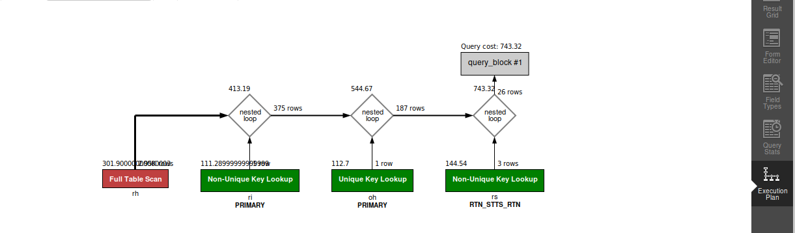

## QUERY
    2. Leading up to the New Year, what is the count of orders shipped from stores in the 25 days preceding the New Year?
    


## SOLUTION

``` sql
select
  count(distinct oisg.order_id)
from 
  order_header oh 
  join order_status os on oh.order_id = os.order_id 
  and os.STATUS_ID = "ORDER_COMPLETED" 
  join order_item_ship_group oisg on oisg.order_id = os.order_id 
  join facility f on f.FACILITY_ID = oisg.FACILITY_ID 
  join facility_type ft on ft.facility_type_id = f.facility_type_id
where 
  ft.PARENT_TYPE_ID = "PHYSICAL_STORE"
  and os.STATUS_DATETIME >= DATE_SUB("2024-01-01", INTERVAL 25 DAY) 
  and os.STATUS_DATETIME < "2024-01-01";

```

## OUTPUT 


## QUERY COST 


Cost : 4688 