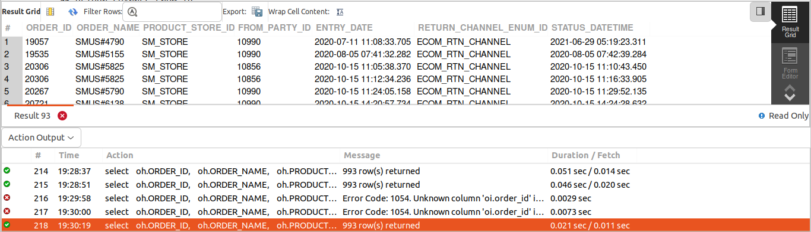
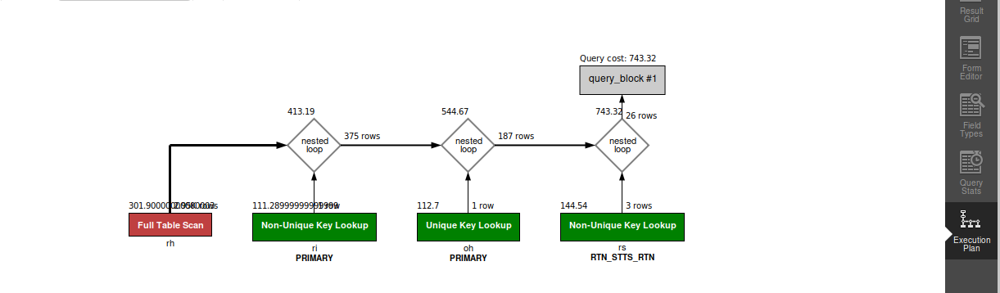

    
## QUERY
    Fetch the following columns for completed return items of SM_STORE for ecom return channel.
    RETURN_ID 
    ORDER_ID
    PRODUCT_STORE_ID 
    STATUS_DATETIME
    ORDER_NAME 
    FROM_PARTY_ID 
    RETURN_DATE 
    ENTRY_DATE
    RETURN_CHANNEL_ENUM_ID

## SOLUTION
    
``` sql
  select 
    oh.ORDER_ID, 
    oh.ORDER_NAME, 
    oh.PRODUCT_STORE_ID, 
    rh.FROM_PARTY_ID, 
    rh.ENTRY_DATE, 
    rh.RETURN_CHANNEL_ENUM_ID, 
    rs.STATUS_DATETIME 
  from 
    order_header oh 
    join return_item ri on ri.order_id = oh.order_id
    and ri.order_id = oh.order_id 
    join return_header rh on rh.return_id = ri.return_id 
    join return_status rs on rs.return_item_seq_id = ri.return_item_seq_id 
    and rs.return_id = ri.return_id 
  where 
    rs.status_id = "RETURN_COMPLETED" 
    and rh.return_channel_enum_id = "ECOM_RTN_CHANNEL" 
    and oh.product_store_id = "SM_STORE";

```

## OUTPUT


## QUERY COST 


