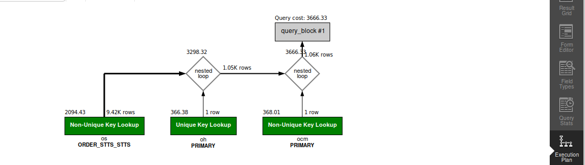

## QUERY

    In the period following the New Year, what is the number of orders shipped from stores in the first 25 days?


## SOLUTION

``` sql
select 
  count(distinct oisg.order_id) 
from 
  order_header oh 
  join order_status os on oh.order_id = os.order_id 
  and oh.STATUS_ID = "ORDER_COMPLETED" 
  and os.STATUS_ID = "ORDER_COMPLETED" 
  join order_item_ship_group oisg on oisg.order_id = os.order_id 
  join facility f on f.FACILITY_ID = oisg.FACILITY_ID 
where 
  f.FACILITY_TYPE_ID in ("RETAIL_STORE", "OUTLET_STORE") 
  and os.STATUS_DATETIME >= DATE_SUB("2024-01-01", INTERVAL 25 DAY) 
  and os.STATUS_DATETIME < "2024-01-01";
```

## OUTPUT 


## QUERY COST 

