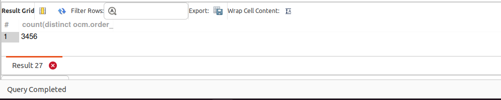

## QUERY

    4. What is the total number of orders originating from New York ?

## SOLUTION

``` sql
select 
  count(distinct ocm.order_id) 
from 
  order_contact_mech ocm 
  join postal_address pa on ocm.contact_mech_id = pa.contact_mech_id 
where 
  ocm.contact_mech_purpose_type_id = "SHIPPING_LOCATION" 
  and pa.city = "New York";
```

## OUTPUT 



## QUERY COST 

