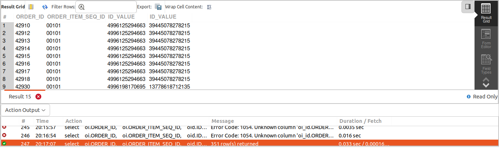
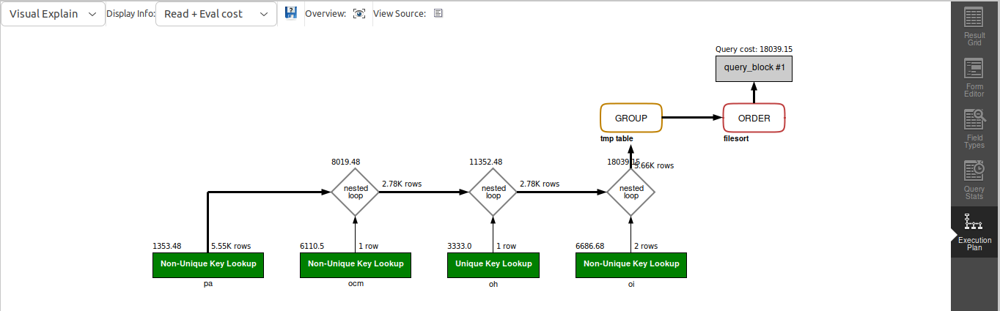

## QUERY

    5. In New York, which product has the highest sales?


## SOLUTION

``` sql
select 
  oi.order_id, 
  oi.product_id, 
  sum(oi.quantity) as maxProductsales 
from 
  order_header oh 
  join order_item oi on oi.order_id = oh.order_id 
  join order_contact_mech ocm on oh.order_id = ocm.order_id 
  join postal_address pa on ocm.contact_mech_id = pa.contact_mech_id 
where 
  ocm.contact_mech_purpose_type_id = "SHIPPING_LOCATION" 
  and pa.city = "New York" 
group by 
  oi.product_id 
order by 
  productCount desc 
limit  1;
```

## OUTPUT 


## QUERY COST 
