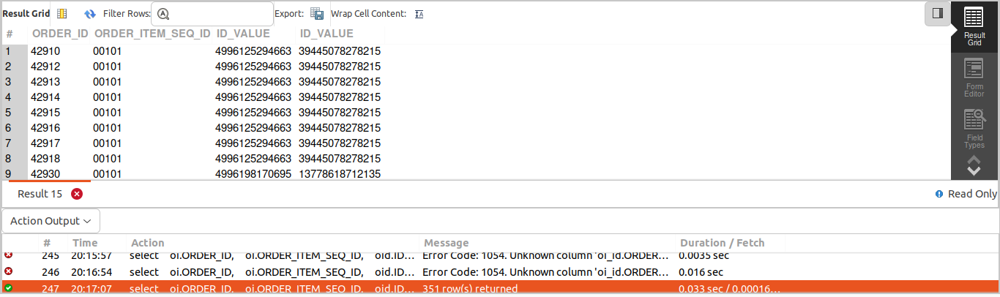
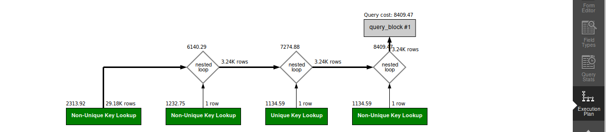

## QUERY
    Fetch the following data for completed order items in July of 2023
    ORDER_ID
    ORDER_ITEM_SEQ_ID
    SHOPIFY_ORDER_ID
    SHOPIFY_PRODUCT_ID


## SOLUTION
```sql
select 
  oi.ORDER_ID, 
  oi.ORDER_ITEM_SEQ_ID, 
  gi.ID_VALUE, 
  oid.ID_VALUE 
from 
  order_item oi 
  join order_status os on oi.ORDER_ID = os.ORDER_ID 
  and oi.ORDER_ITEM_SEQ_ID = os.ORDER_ITEM_SEQ_ID 
  join order_identification oid on oi.ORDER_ID = oid.ORDER_ID 
  join good_identification gi on oi.PRODUCT_ID = gi.PRODUCT_ID 
where 
  os.STATUS_ID = "ITEM_COMPLETED" 
  and gi.GOOD_IDENTIFICATION_TYPE_ID = "SHOPIFY_PROD_ID" 
  and oid.ORDER_IDENTIFICATION_TYPE_ID = "SHOPIFY_ORD_ID" 
  and os.status_datetime between '2023-07-01' 
  and '2023-07-31';
```

## OUTPUT


## QUERY COST 
