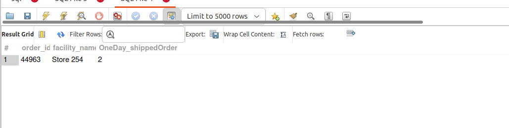
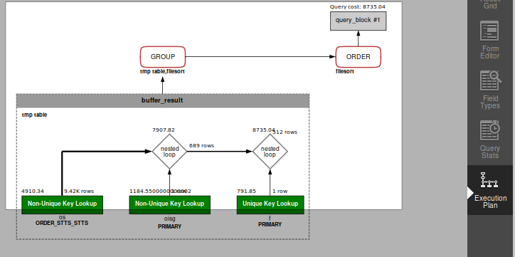

## QUERY

 6. In the past month, which store has the highest number of one-day shipped orders?


## SOLUTION

``` sql
select 
  oisg.order_id, 
  f.facility_name, 
  count(DISTINCT oisg.order_id) as OneDay_shippedOrders 
from 
  order_status os 
  join order_item_ship_group oisg on oisg.order_id = os.order_id 
  and os.status_id = "ORDER_COMPLETED" 
  join facility f on f.facility_id = oisg.facility_id 
where 
  f.facility_type_id in ('RETAIL_STORE', 'OUTLET_STORE') 
  and oisg.shipment_method_type_id = "NEXT_DAY" 
  and os.status_datetime >= DATE_SUB(
    CURDATE(), 
    INTERVAL 1 MONTH
  ) 
  and os.status_datetime < CURDATE() 
group by 
  oisg.facility_id 
order by 
  OneDay_shippedOrders desc 
limit 1;
```

## OUTPUT 


## QUERY COST 

