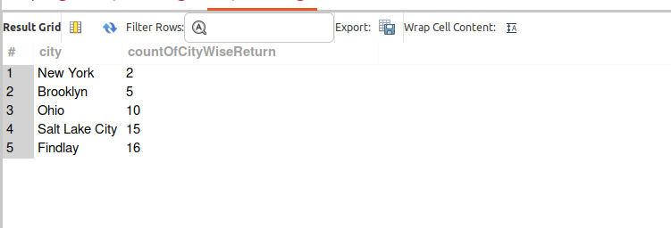
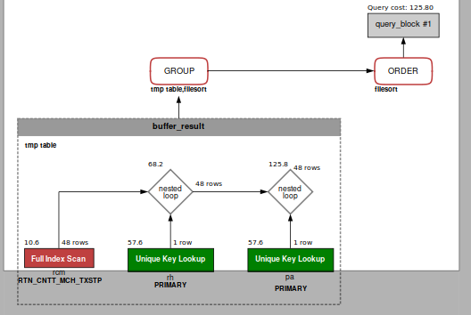

## QUERY

    
    7. On a city-wise basis, what is the analysis of returns?

## SOLUTION

``` sql
select 
  pa.city, 
  count(distinct rh.return_id) as countOfCityWiseReturn 
from 
  return_header rh 
  join return_contact_mech rcm on rh.return_id = rcm.return_id 
  join postal_address pa on pa.contact_mech_id = rcm.contact_mech_id 
group by 
  pa.city 
order by 
  countOfCityWiseReturn;

```

## OUTPUT 



## QUERY COST 

