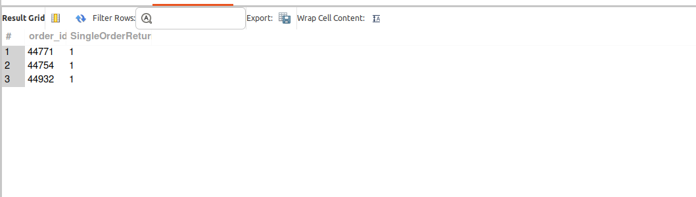
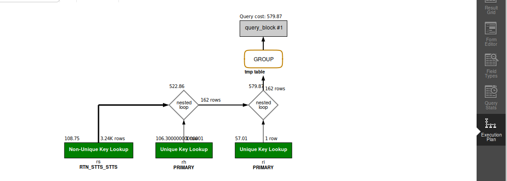

## QUERY

    8. How many orders	 with a single return were recorded in the last month?

## SOLUTION

``` sql
select 
  ri.order_id, 
  COUNT(ri.RETURN_ID) as SingleOrderReturn 
from 
  return_item ri 
  join return_header rh on ri.return_id = rh.return_id 
  and rh.status_id = "RETURN_COMPLETED" 
  join return_status rs on rs.return_id = ri.return_id 
  and rs.return_item_seq_id = ri.return_item_seq_id 
  and rs.status_id = "RETURN_COMPLETED" 
where 
  rs.status_datetime >= DATE_SUB(
    CURDATE(), 
    INTERVAL 1 MONTH
  ) 
  and rs.status_datetime < CURDATE() 
group by 
  ri.order_id 
having 
  SingleOrderReturn = 1;

```

## OUTPUT 



## QUERY COST 

